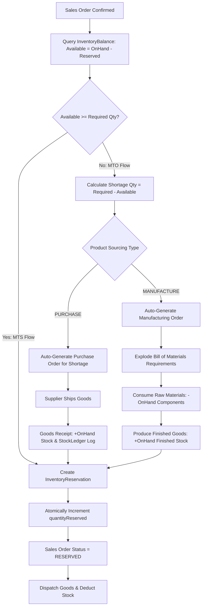

# Mini-ERP SaaS Platform — Shiv Furniture Works

> A modern, multi-tenant manufacturing enterprise resource planning (ERP) platform built with Node.js, Express, MongoDB Atlas, React, and Vite. Designed to orchestrate end-to-end manufacturing workflows: product engineering, inventory balances, MTS/MTO procurement strategies, Bill of Materials (BoM) explosion, purchase lifecycle, and immutable stock ledger auditability.

---

[](https://nodejs.org/)
[](https://react.dev/)
[](https://vitejs.dev/)
[](https://www.mongodb.com/)
[](https://tailwindcss.com/)
[](backend/tests/)
[](LICENSE)

---

## 1. Product Overview

Shiv Furniture Works is a high-mix custom and batch manufacturing enterprise. This Mini-ERP SaaS replaces disconnected spreadsheets and siloed CRUD tools with a reactive, unified transaction engine that links commercial sales directly to shop-floor production and supplier procurement.

```
                               ┌────────────────────────┐
                               │     Product Catalog    │
                               └───────────┬────────────┘
                                           │
                                           ▼
                               ┌────────────────────────┐
                               │   Sales Order Entry    │
                               └───────────┬────────────┘
                                           │
                                           ▼
                              ┌──────────────────────────┐
                              │ Atomic Inventory Check   │
                              └────────────┬─────────────┘
                                           │
                    ┌──────────────────────┴──────────────────────┐
                    ▼                                             ▼
       ┌────────────────────────┐                    ┌────────────────────────┐
       │   Make-to-Stock (MTS)  │                    │   Make-to-Order (MTO)  │
       │ (Sufficient Inventory) │                    │   (Shortage Detected)  │
       └────────────┬───────────┘                    └────────────┬───────────┘
                    │                                             │
                    ▼                                             ▼
       ┌────────────────────────┐                    ┌────────────────────────┐
       │ Immediate Reservation  │                    │ Procurement Strategy   │
       └────────────┬───────────┘                    └────────────┬───────────┘
                    │                                             │
                    │                    ┌────────────────────────┴────────────────────────┐
                    │                    ▼                                                 ▼
                    │       ┌────────────────────────┐                        ┌────────────────────────┐
                    │       │ Purchase Order (PO)    │                        │ Manufacturing Order    │
                    │       │   (Raw Materials)      │                        │     (Custom Goods)     │
                    │       └────────────┬───────────┘                        └────────────┬───────────┘
                    │                    │                                                 │
                    │                    ▼                                                 ▼
                    │       ┌────────────────────────┐                        ┌────────────────────────┐
                    │       │ Idempotent Receipt     │                        │ BoM Explosion & Work   │
                    │       │ & Stock Ledger Entry   │                        │ Center Component Draw  │
                    │       └────────────┬───────────┘                        └────────────┬───────────┘
                    │                    │                                                 │
                    │                    └────────────────────────┬────────────────────────┘
                    │                                             │
                    ▼                                             ▼
       ┌────────────────────────────────────────────────────────────────────────┐
       │             Delivery Dispatch & Inventory Balance Deduction            │
       └───────────────────────────────────┬────────────────────────────────────┘
                                           │
                                           ▼
       ┌────────────────────────────────────────────────────────────────────────┐
       │                 Immutable Multi-Tenant Audit Logging                   │
       └────────────────────────────────────────────────────────────────────────┘
```

---

## 2. Core Value Proposition

| Architecture Pillar | Technical Implementation | Business Impact |
|:---|:---|:---|
| **Atomic Inventory Engine** | MongoDB ACID Sessions with conditional increment operators (`$inc`, `quantityOnHand - quantityReserved >= requested`) | Eliminates double-allocation and overselling race conditions during peak commercial order inflow. |
| **Double-Entry Stock Ledger** | Immutable audit trail recorded for every positive (`PO_RECEIPT`, `PROD_RECEIPT`) and negative (`SALES_DELIVERY`, `PROD_CONSUMPTION`) delta | Ensures GAAP-grade inventory accounting, serial traceability, and valuation transparency. |
| **MTS / MTO Decision Engine** | Real-time availability calculation: `Available = OnHand - Reserved`. Dynamic routing to Purchase or Manufacturing | Minimizes warehouse holding costs while ensuring zero fulfillment delays for made-to-order furniture. |
| **Hierarchical BoM Engine** | Multi-level Bill of Materials explosion factoring scrap percentages and work center capacity | Accurately calculates material shortages down to hardware screws and wood stain before launching production. |
| **Granular Domain RBAC** | Role-Based Access Control supporting wildcard tokens (`*`, `sales.*`, `inventory.view`) with tenant isolation | Enables secure multi-user delegation across Owners, Sales Executives, Plant Managers, and Inventory Clerks. |
| **Stateless JWT + HTTP-Only Cookie** | Secure cookie transport (`SameSite=Lax`, `HttpOnly=true`, signed JSON Web Tokens) with dual login identifiers | Hardens session security against XSS token leakage while providing seamless React SPA state hydration. |

---

## 3. Implementation Feature Matrix

| Module | Capability | Implementation Details | Status |
|:---|:---|:---|:---:|
| **Authentication** | Dual Identifier Login | Login via Employee ID (`ADMIN01`, `SALE01`) or Corporate Email | ✅ Implemented |
| **Authentication** | Transport Security | HTTP-Only, Secure, SameSite Cookie with JWT claims | ✅ Implemented |
| **Authorization** | Wildcard RBAC | Regex permission matcher supporting `*`, `<domain>.*`, and exact scope | ✅ Implemented |
| **Multi-Tenancy** | Organization Scoping | Auto-injection of `organizationId` across all Mongoose queries and mutations | ✅ Implemented |
| **Products** | Engineering Master | SKU, Categories, Finished Goods vs Raw Materials, Supplier mapping, Unit Costs | ✅ Implemented |
| **Inventory** | Real-Time Balances | Stock levels tracked by `quantityOnHand`, `quantityReserved`, `quantityAvailable` | ✅ Implemented |
| **Inventory** | Stock Ledger | Immutable double-entry ledger with unit cost, reference document, and timestamp | ✅ Implemented |
| **Inventory** | Cycle Count Adjustment | Reconcile physical inventory with variance accounting | ✅ Implemented |
| **Sales** | Order Lifecycle | `DRAFT` ➔ `CONFIRMED` ➔ `RESERVED` ➔ `DELIVERED` / `CANCELLED` | ✅ Implemented |
| **Procurement** | Dynamic MTS / MTO | Automated shortage evaluation routing to PO or MO | ✅ Implemented |
| **Purchasing** | Purchase Order Lifecycle | `DRAFT` ➔ `CONFIRMED` ➔ Partial / Full `RECEIVED` | ✅ Implemented |
| **Purchasing** | Idempotent Goods Receipt | Receipt validation preventing over-receiving against open PO quantities | ✅ Implemented |
| **Manufacturing** | Bill of Materials (BoM) | Multi-component requirements calculation with scrap allowance | ✅ Implemented |
| **Manufacturing** | Manufacturing Orders | Status progression: `PLANNED` ➔ `IN_PROGRESS` ➔ `COMPLETED` with BoM consumption | ✅ Implemented |
| **Audit Trail** | Activity Telemetry | Automated event stream tracking Actor, Action, Entity, and State Change | ✅ Implemented |
| **Dashboard** | Aggregated Telemetry | Real-time MongoDB aggregations for KPIs, revenue trajectories, and inventory alerts | ✅ Implemented |

---

## 4. Deep-Dive: Domain Architecture & Workflows

### A. Authentication & Identity Layer
Authentication supports dual login credentials (`loginId` matching `employeeId` or `email`). Passwords are encrypted using standard `bcryptjs` hashing. Upon successful verification, the backend issues a signed JWT transported via an `HttpOnly` cookie (`token`), mitigating cross-site scripting (XSS) attack vectors.

```mermaid
sequenceDiagram
    autonumber
    actor User as Client (Browser)
    participant ClientAPI as api.js (Axios/Fetch)
    participant AuthCtrl as auth.controller.js
    participant UserDB as User Model (MongoDB)

    User->>ClientAPI: Enter "ADMIN01" + Password
    ClientAPI->>AuthCtrl: POST /api/v1/auth/login { loginId, password }
    AuthCtrl->>UserDB: User.findOne({ $or: [{ employeeId }, { email }] })
    UserDB-->>AuthCtrl: User Record (Hashed Password + Role + OrgId)
    AuthCtrl->>AuthCtrl: bcrypt.compare(password, user.password)
    AuthCtrl->>AuthCtrl: jwt.sign({ id, organizationId, role, permissions })
    AuthCtrl-->>ClientAPI: HTTP 200 (Set-Cookie: token=<jwt>; HttpOnly; SameSite=Lax)
    ClientAPI-->>User: Transition to /layout Dashboard
```

### B. RBAC (Role-Based Access Control)
The RBAC middleware (`backend/src/middleware/auth.js`) implements a hierarchical wildcard matching strategy:

```javascript
export const checkPermission = (requiredPermission) => {
  return (req, res, next) => {
    const userPermissions = req.user?.permissions || [];
    if (userPermissions.includes('*')) return next();

    const hasMatch = userPermissions.some(perm => {
      if (perm === requiredPermission) return true;
      if (perm.endsWith('.*')) {
        const domain = perm.split('.')[0];
        return requiredPermission.startsWith(`${domain}.`);
      }
      return false;
    });

    if (!hasMatch) {
      return res.status(403).json({ error: { code: 'FORBIDDEN', message: 'Access denied' } });
    }
    next();
  };
};
```

---

### C. MTS / MTO Procurement & Manufacturing Decision Engine

When a commercial Sales Order is confirmed, the procurement engine calculates available stock. If demand exceeds availability, it generates procurement demand automatically based on product configuration:



---

## 5. Technology Stack

### Backend
- **Runtime**: Node.js (v20+)
- **Framework**: Express.js (v4.18)
- **Database**: MongoDB Atlas via Mongoose ORM (v8.1)
- **Security & Utilities**:
  - `bcryptjs`: Password hashing
  - `jsonwebtoken`: Stateless authentication tokens
  - `cookie-parser`: Secure HTTP-only cookie management
  - `helmet` & `cors`: Request header protection and domain whitelisting
  - `pino` & `pino-http`: High-performance structured JSON logging
  - `zod`: Request payload contract validation

### Frontend
- **Framework**: React 18 with Vite 5
- **Styling**: Tailwind CSS v4 + Claymorphic Bento Grid Design System
- **State & Context**: React Context (`ErpContext`) with permission-aware data hydration
- **Animations**: `framer-motion` for route transitions and micro-interactions
- **Charts & Data Visualization**: `recharts` for Recharts Area, Spline, Donut, and Bar telemetry
- **Icons**: `lucide-react`

---

## 6. Repository Directory Structure

```
.
├── backend/
│   ├── src/
│   │   ├── controllers/          # HTTP request handlers (auth, sales, inventory, po, mo, bom)
│   │   ├── middleware/           # auth, rbac, error handling, request logging
│   │   ├── models/               # Mongoose schemas (User, Product, BoM, StockLedger, etc.)
│   │   ├── routes/               # Modular Express API routers
│   │   ├── services/             # Core business logic (inventory, procurement, sales, manufacturing)
│   │   ├── utils/                # Token generation, password hashing, error definitions
│   │   ├── app.js                # Express application configuration & middleware pipeline
│   │   ├── seed.js               # Database population script with seed accounts
│   │   └── server.js             # HTTP server entry point (port binding 0.0.0.0:5000)
│   ├── tests/                    # Automated Node.js native test suites
│   │   ├── audit_dashboard.test.js
│   │   ├── auth.test.js
│   │   ├── bom.test.js
│   │   ├── concurrency.test.js
│   │   ├── inventory.test.js
│   │   ├── multitenancy.test.js
│   │   ├── purchase.test.js
│   │   ├── rbac.test.js
│   │   └── sales_mts_mto.test.js
│   └── package.json
├── frontend/
│   ├── src/
│   │   ├── components/
│   │   │   ├── common/           # Login, AdminLogin, Signup, ProtectedRoute, RoleRoute
│   │   │   ├── dashboard/        # Starline Bento Box Dashboard & Recharts visualizations
│   │   │   ├── inventory/        # Inventory Balances, Products, Stock Ledger
│   │   │   ├── layout/           # Layout, Sidebar, TopHeader, PageTransition
│   │   │   ├── manufacturing/    # Manufacturing Orders, Bill of Materials
│   │   │   ├── purchase/         # Purchase Orders, Vendor Master
│   │   │   └── sales/            # Sales Orders, Customer Master
│   │   ├── context/              # ErpContext (state, RBAC filters, API dispatchers)
│   │   ├── lib/                  # api.js API client abstraction
│   │   ├── App.jsx               # React Router configuration & guards
│   │   ├── main.jsx              # Application bootstrap
│   │   └── index.css             # Tailwind design tokens & base styles
│   ├── vite.config.js            # Vite build configuration & development proxy
│   └── package.json
├── .gitignore
└── README.md
```

---

## 7. Seed Credentials & Test Accounts

Run `npm run seed` in the `backend/` directory to reset and populate the database with the following demo users:

| Role | Employee ID | Email | Password | Assigned Permissions |
|:---|:---|:---|:---|:---|
| **System Administrator** | `ADMIN01` | `admin@shivfurniture.in` | `password123` | `*` (Full System Wildcard) |
| **Business Owner** | `OWNER01` | `owner@shivfurniture.in` | `password123` | `*` (Full System Wildcard) |
| **Sales Representative** | `SALE01` | `sales@shivfurniture.in` | `password123` | `sales.*`, `customer.*`, `product.view`, `inventory.view` |
| **Procurement Specialist** | `PUR01` | `purchase@shivfurniture.in` | `password123` | `purchase.*`, `vendor.*`, `product.view`, `inventory.view` |
| **Production Manager** | `MFG01` | `mfg@shivfurniture.in` | `password123` | `manufacturing.*`, `bom.*`, `product.view`, `inventory.view` |
| **Inventory Clerk** | `INV01` | `inventory@shivfurniture.in` | `password123` | `inventory.*`, `product.view` |

---

## 8. Installation & Local Development

### Prerequisites
- **Node.js**: v20.x or higher
- **npm**: v10.x or higher
- **MongoDB**: Local MongoDB instance or MongoDB Atlas connection URI

### Step 1: Clone the Repository
```bash
git clone https://github.com/inderash18/ERP.git
cd ERP
```

### Step 2: Configure Environment Variables
Create `.env` inside `backend/`:

```env
PORT=5000
NODE_ENV=development
MONGODB_URI=mongodb://127.0.0.1:27017/mini-erp
JWT_SECRET=super_secret_jwt_encryption_key_production_grade
JWT_EXPIRES_IN=7d
CORS_ORIGIN=http://localhost:5173
```

Create `.env` inside `frontend/` (optional, defaults to local proxy):
```env
VITE_API_URL=http://localhost:5000
```

### Step 3: Install Dependencies
```bash
# Install backend packages
cd backend
npm install

# Install frontend packages
cd ../frontend
npm install
```

### Step 4: Seed the Database
```bash
cd ../backend
npm run seed
```

### Step 5: Start Development Servers
In Terminal 1 (Backend):
```bash
cd backend
npm run dev
# Server listening on http://127.0.0.1:5000
```

In Terminal 2 (Frontend):
```bash
cd frontend
npm run dev
# Vite dev server running at http://localhost:5173
```

---

## 9. Automated Testing Suite

The backend includes a comprehensive, database-backed automated test suite covering concurrency, transactions, multi-tenancy, RBAC, and MTS/MTO end-to-end flows using Node.js's native test runner (`node --test`).

```bash
cd backend
npm test
```

### Test Suite Summary

```
▶ Audit Logging & Dashboard Telemetry Tests
  ✔ should record immutable audit logs scoped by organizationId (54ms)
  ✔ should compute real Dashboard metrics from MongoDB aggregations (866ms)
✔ Audit Logging & Dashboard Telemetry Tests (4308ms)

▶ Authentication & User Resolution Tests
  ✔ A. Employee ID login (ADMIN01 / password123) should return HTTP 200, user data, and JWT cookie (1015ms)
  ✔ B. Email login (admin@shivfurniture.in / password123) should return HTTP 200 and user data (367ms)
  ✔ C. Invalid password should return HTTP 401 (312ms)
  ✔ D. Authenticated /me endpoint should return authenticated user details using cookie (686ms)
  ✔ E. Logout should clear JWT cookie and subsequent /me should return 401 (21ms)
✔ Authentication & User Resolution Tests (6462ms)

▶ Bill of Materials (BoM) Calculation & Validation Tests
  ✔ should calculate dynamic requirements multiplied by target batch quantity (136ms)
✔ Bill of Materials (BoM) Calculation & Validation Tests (5655ms)

▶ Concurrency & Stock Invariant Tests
  ✔ should prevent race condition when 2 concurrent requests try to reserve 8 units each on 10 stock (152ms)
✔ Concurrency & Stock Invariant Tests (4577ms)

▶ Inventory Engine & Atomic Transaction Tests
  ✔ should increase stock and record in StockLedger atomically (187ms)
  ✔ should reserve stock and update available calculation (152ms)
  ✔ should prevent reserving more stock than available (640ms)
  ✔ should decrease stock and create negative movement ledger entry (132ms)
  ✔ should adjust physical stock via cycle count and update ledger (129ms)
✔ Inventory Engine & Atomic Transaction Tests (5478ms)

▶ Multi-Tenancy & Data Isolation Tests
  ✔ should isolate product queries between tenants (Read Isolation) (58ms)
  ✔ Tenant A should not be able to find or query Tenant B products (Cross-tenant Leak Prevention) (28ms)
  ✔ Tenant A should not be able to update Tenant B products (Write Isolation) (55ms)
  ✔ Tenant A should not be able to delete Tenant B products (Delete Isolation) (48ms)
✔ Multi-Tenancy & Data Isolation Tests (5466ms)

▶ Purchase Order Lifecycle & Idempotent Receipt Tests
  ✔ should create and confirm a Purchase Order (233ms)
  ✔ should support partial goods receipt and update stock (991ms)
  ✔ should reject receipt exceeding remaining pending quantity (78ms)
✔ Purchase Order Lifecycle & Idempotent Receipt Tests (5519ms)

▶ RBAC Wildcard & Permission Matcher Tests
  ✔ should allow wildcard * permission for any required action (1ms)
  ✔ should match domain wildcards (e.g. sales.*) (1ms)
  ✔ should match exact permissions (1ms)
  ✔ should reject unauthorized operations (1ms)
✔ RBAC Wildcard & Permission Matcher Tests (2ms)

▶ End-to-End MTS and MTO Business Flow Tests
  ✔ SCENARIO 1 (MTS): Should reserve stock and fulfill order when sufficient stock is available (904ms)
  ✔ SCENARIO 2 (MTO Manufacturing): Should detect shortage of 15 tables, auto-create MO, consume BoM components, produce FG, and fulfill Sales Order (1937ms)
  ✔ SCENARIO 3 (MTO Purchase): Should detect shortage of 8 chairs, auto-create PO, receive goods, and fulfill Sales Order (1594ms)
✔ End-to-End MTS and MTO Business Flow Tests (7393ms)

────────────────────────────────────────────────
ℹ Total Suites: 9 | Total Tests: 28 Passed | 0 Failed
────────────────────────────────────────────────
```

---

## 10. Core API Reference

All endpoints are scoped under `/api/v1` and require authenticated sessions (except public login/registration routes).

<details>
<summary><strong>🔐 Authentication & Identity Endpoints</strong></summary>

| Method | Endpoint | Description | Required Permission |
|:---|:---|:---|:---|
| `POST` | `/api/v1/auth/login` | Authenticate user via Employee ID or Email and issue JWT cookie | Public |
| `POST` | `/api/v1/auth/register` | Register an initial organization account | Public |
| `POST` | `/api/v1/auth/logout` | Invalidate authenticated session and clear cookie | Authenticated |
| `GET` | `/api/v1/auth/me` | Fetch active user identity, role, and granted permissions | Authenticated |
</details>

<details>
<summary><strong>📦 Products & Bill of Materials (BoM) Endpoints</strong></summary>

| Method | Endpoint | Description | Required Permission |
|:---|:---|:---|:---|
| `GET` | `/api/v1/products` | Retrieve all products in organization catalog | `product.view` |
| `POST` | `/api/v1/products` | Create a new Raw Material, Component, or Finished Good | `product.create` |
| `PUT` | `/api/v1/products/:id` | Update product master metadata, prices, and reorder levels | `product.edit` |
| `DELETE`| `/api/v1/products/:id` | Delete product item (guarded against active ledger usage) | `product.delete` |
| `GET` | `/api/v1/boms` | List all engineering Bill of Materials | `bom.view` |
| `POST` | `/api/v1/boms` | Register a multi-component BoM recipe | `bom.create` |
| `POST` | `/api/v1/boms/calculate-requirements` | Calculate total component quantities required for batch volume | `bom.view` |
</details>

<details>
<summary><strong>📊 Inventory & Stock Ledger Endpoints</strong></summary>

| Method | Endpoint | Description | Required Permission |
|:---|:---|:---|:---|
| `GET` | `/api/v1/inventory` | List all inventory balances with OnHand, Reserved, Available | `inventory.view` |
| `GET` | `/api/v1/inventory/:productId/ledger` | Fetch immutable transaction ledger history for a product | `inventory.view` |
| `POST` | `/api/v1/inventory/adjust` | Record cycle count stock adjustment with variance justification | `inventory.adjust` |
</details>

<details>
<summary><strong>🛒 Sales & Procurement Endpoints</strong></summary>

| Method | Endpoint | Description | Required Permission |
|:---|:---|:---|:---|
| `GET` | `/api/v1/sales-orders` | List sales orders with fulfillment status | `sales.view` |
| `POST` | `/api/v1/sales-orders` | Create a new commercial customer sales order | `sales.create` |
| `POST` | `/api/v1/sales-orders/:id/confirm` | Confirm order and execute atomic inventory reservation / MTS check | `sales.confirm` |
| `POST` | `/api/v1/sales-orders/:id/deliver` | Dispatch order, deduct OnHand inventory, and write ledger log | `sales.deliver` |
| `POST` | `/api/v1/sales-orders/:id/cancel` | Cancel order and atomically release reserved inventory | `sales.cancel` |
| `POST` | `/api/v1/procurement/evaluate` | Evaluate demand requirements and trigger automated PO / MO creation | `procurement.manage` |
</details>

<details>
<summary><strong>🚚 Purchase & Vendor Endpoints</strong></summary>

| Method | Endpoint | Description | Required Permission |
|:---|:---|:---|:---|
| `GET` | `/api/v1/purchase-orders` | List purchase orders and receiving status | `purchase.view` |
| `POST` | `/api/v1/purchase-orders` | Create a new vendor purchase order | `purchase.create` |
| `POST` | `/api/v1/purchase-orders/:id/confirm` | Confirm purchase order with supplier | `purchase.confirm` |
| `POST` | `/api/v1/purchase-orders/:id/receive` | Idempotent goods receipt: increment stock and create ledger entries | `purchase.receive` |
</details>

<details>
<summary><strong>🏭 Manufacturing & Production Endpoints</strong></summary>

| Method | Endpoint | Description | Required Permission |
|:---|:---|:---|:---|
| `GET` | `/api/v1/manufacturing-orders` | List production batches and stage progress | `manufacturing.view` |
| `POST` | `/api/v1/manufacturing-orders` | Launch a production batch for a Finished Good | `manufacturing.create` |
| `POST` | `/api/v1/manufacturing-orders/:id/progress` | Update completed units and shop floor progress | `manufacturing.edit` |
| `POST` | `/api/v1/manufacturing-orders/:id/complete` | Finalize batch: consume raw materials and output Finished Goods | `manufacturing.complete` |
</details>

<details>
<summary><strong>📈 Dashboard Telemetry & Audit Logs</strong></summary>

| Method | Endpoint | Description | Required Permission |
|:---|:---|:---|:---|
| `GET` | `/api/v1/dashboard` | Aggregated telemetry (Revenue, Inventory Valuation, Active POs/MOs, Alerts) | Authenticated |
| `GET` | `/api/v1/audit-logs` | Query immutable multi-tenant audit events | `admin` |
</details>

---

## 11. Production Deployment Guidelines

### Production Environment Variables
Ensure all sensitive keys are supplied via secure secrets management (e.g. AWS Secrets Manager, Doppler, or Cloudflare Secrets):

```env
NODE_ENV=production
PORT=5000
MONGODB_URI=mongodb+srv://<user>:<password>@cluster.mongodb.net/mini-erp-prod?retryWrites=true&w=majority
JWT_SECRET=<64_character_cryptographically_secure_random_string>
JWT_EXPIRES_IN=7d
CORS_ORIGIN=https://erp.shivfurniture.in
```

### Production Build
```bash
# Build optimized frontend bundle
cd frontend
npm run build
# Output generated in frontend/dist/
```

---

## 12. License

This project is licensed under the **MIT License** — see the [LICENSE](LICENSE) file for full terms and conditions.

---

**Shiv Furniture Works Enterprise ERP** • Engineered for robust manufacturing operational control.